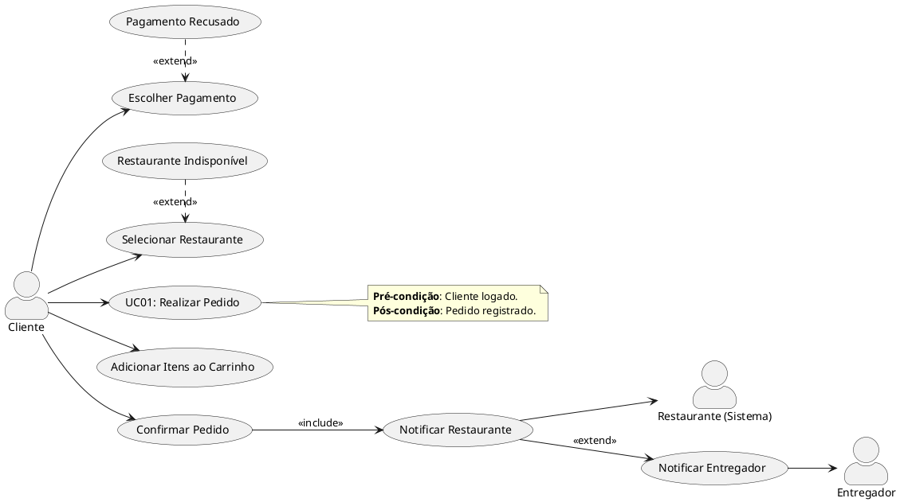
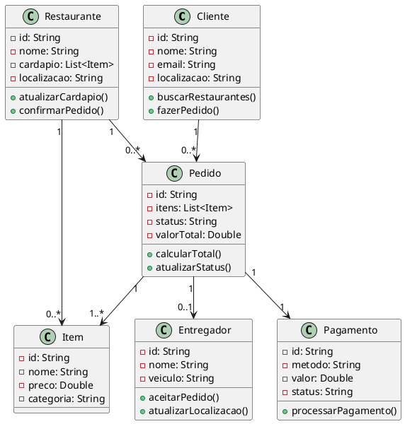

# **06 - Levantamento de Requisitos e Caso de Uso**

**Sistema:** Aplicativo de Delivery de Comida (*"FastDelivery"*)

---

## **1. Identificação dos Stakeholders**

- **Clientes:** Pessoas que fazem pedidos.
- **Restaurantes:** Estabelecimentos parceiros.
- **Entregadores:** Responsáveis pela logística.
- **Administrador:** Gerencia o sistema.

---

### **2. Requisitos Funcionais (Exemplos)**

| ID   | Descrição                                                                    | Prioridade |
| ---- | ------------------------------------------------------------------------------ | ---------- |
| RF01 | O cliente deve poder buscar restaurantes por nome, categoria ou localização. | Alta       |
| RF02 | O restaurante deve poder atualizar seu cardápio no sistema.                   | Média     |
| RF03 | O entregador deve receber notificações de novos pedidos.                     | Alta       |

### **3. Requisitos Não Funcionais**

- **Performance:** O app deve carregar em menos de 3 segundos.
- **Segurança:** Dados de pagamento criptografados (PCI Compliance).
- **Usabilidade:** Interface intuitiva (testes com usuários reais).

---

### **4. Exemplo de Caso de Uso**

#### **UC01 - Realizar Pedido**

- **Atores:** Cliente, Sistema.
- **Pré-condição:** Cliente está logado e com localização ativa.
- **Fluxo Principal:**
  1. Cliente seleciona um restaurante.
  2. Cliente adiciona itens ao carrinho.
  3. Cliente escolhe a forma de pagamento (cartão/PIX).
  4. Sistema confirma o pedido e notifica o restaurante.
- **Fluxos Alternativos:**
  - **FA1:** Pagamento recusado → Sistema sugere nova tentativa ou outro método.
  - **FA2:** Restaurante indisponível → Sistema recomenda opções similares.
- **Pós-condição:** Pedido é registrado e entra na fila de preparo.

---

### **5. Protótipo (Exemplo Simplificado)**

- **Tela de Busca:** Barra de pesquisa + filtros (vegan, rápido, etc.).
- **Carrinho:** Resumo dos itens + botão "Finalizar Pedido".

---

### **6. Validação**

- **Workshop com Restaurantes:** Confirmar se o fluxo de atualização de cardápio é viável.
- **Teste A/B com Clientes:** Comparar duas versões do checkout para melhorar conversão.


--

### Diagrama de Casos de Uso

Aqui está o diagrama de **Caso de Uso (UML)** para o cenário de **"Realizar Pedido"** no aplicativo de delivery, usando **PlantUML**:

### **Código PlantUML**:


### **Explicação**:
1. **Atores**:
   - `Cliente`: Interage com o sistema para fazer pedidos.
   - `Restaurante` (Sistema): Recebe notificações de pedidos.
   - `Entregador`: Recebe alertas para coleta/entrega.

2. **Fluxo Principal** (dentro do caso de uso `UC01`):
   - Selecionar Restaurante → Adicionar Itens → Escolher Pagamento → Confirmar Pedido.

3. **Relacionamentos**:
   - `<<include>>`: "Confirmar Pedido" **requer** "Notificar Restaurante".
   - `<<extend>>`: Fluxos alternativos (pagamento recusado/restaurante indisponível).

4. **Notas**: Condições do cenário.

---

### **Visualização do Diagrama**:
(Se estiver usando uma IDE como VS Code com extensão PlantUML, o código acima gerará um diagrama similar a este:)

```
+-------------+       +---------------------+
|   Cliente   |       |  Restaurante (Sist) |
+-------------+       +---------------------+
      |                         ^
      v                         |
+---------------------+         |
| UC01: Realizar Pedido|         |
| 1. Selecionar Rest. |         |
| 2. Adicionar Itens  |         |
| 3. Escolher Pagamento|        |
| 4. Confirmar Pedido |----------
+---------------------+  <<include>> 
      |                         
      v                         
+---------------------+         +---------------+
|   Pagamento Recusado |<<extend|  Notificar    |
|   Rest. Indisponível |         | Entregador   |
+---------------------+         +---------------+
                                      ^
                                      |
                              +---------------+
                              |   Entregador  |
                              +---------------+
```

---

### **Dica**:
- Para ver o diagrama visualmente, cole o código em ferramentas como:
  - [PlantText](https://www.planttext.com/)
  - [PlantUML Web Server](http://www.plantuml.com/plantuml/uml/).

---

### Protótipo

Aqui está o protótipo de **telas do aplicativo de delivery** usando **Salt (PlantUML)**, alinhado ao caso de uso anterior:

---

### **Código PlantUML (Salt)**

```plantuml
@startsalt
{
  {^
    <b>FastDelivery - Buscar Restaurantes</b>
  }
  {
    [🔍 Buscar...] | [Filtros ▼]
  }
  {
    (X) Restaurante A      | ⭐ 4.5
    () Restaurante B      | ⭐ 4.2
    () Restaurante C      | ⭐ 4.7
  }
  {
    [Ver Cardápio] | [Voltar]
  }
}

@startsalt
{
  {^
    <b>Restaurante A - Cardápio</b>
  }
  {
    (X) Pizza Margherita   | R$ 35.00
    () Hambúrguer Artesanal | R$ 28.00
    () Salada Caesar       | R$ 22.00
  }
  {
    [Adicionar ao Carrinho] | [Voltar]
  }
}

@startsalt
{
  {^
    <b>Carrinho de Compras</b>
  }
  {
    "Pizza Margherita"  | R$ 35.00
    "Hambúrguer"       | R$ 28.00
    "Taxa de Entrega"  | R$ 5.00
    --------------------------
    "Total"            | R$ 68.00
  }
  {
    [Continuar para Pagamento] | [Editar]
  }
}

@startsalt
{
  {^
    <b>Pagamento</b>
  }
  {
    () Cartão Crédito (•••• 1234)
    () PIX
    () Dinheiro na Entrega
  }
  {
    [Finalizar Pedido] | [Cancelar]
  }
}

@startsalt
{
  {^
    <b>Pedido Confirmado!</b>
  }
  {
    ! Pedido #1234 recebido!
    "Tempo estimado:" 30-40 min.
  }
  {
    [Acompanhar Pedido] | [Voltar ao Início]
  }
}
```


---

### **Telas Prototipadas (Fluxo do Caso de Uso)**  
1. **Buscar Restaurantes**:  
   - Barra de busca + filtros.  
   - Lista de restaurantes com seleção (radio buttons).  

2. **Cardápio do Restaurante**:  
   - Itens selecionáveis com preços.  
   - Botão para adicionar ao carrinho.  

3. **Carrinho**:  
   - Resumo dos itens + valor total.  
   - Ação para prosseguir ao pagamento.  

4. **Pagamento**:  
   - Opções de pagamento (cartão, PIX, dinheiro).  
   - Confirmação do pedido.  

5. **Confirmação**:  
   - Feedback de sucesso + tempo de entrega.  

---

### **Como Visualizar**  
- Cole o código em ferramentas como:  
  - [PlantText](https://www.planttext.com/) (suporte a Salt).  
  - VS Code com extensão **PlantUML**.  

---

### **Exemplo de Saída (Estilizada)**  
```
+------------------------------+
| FastDelivery - Buscar Restaur.|
+------------------------------+
| [🔍 Buscar...] | [Filtros ▼]  |
+------------------------------+
| (X) Restaurante A | ⭐ 4.5    |
| () Restaurante B  | ⭐ 4.2    |
+------------------------------+
| [Ver Cardápio] | [Voltar]    |
+------------------------------+
```

---

### **Personalização**  
- Para adicionar **mais telas** (ex.: login, acompanhamento de entrega):  
  ```plantuml
  @startsalt
  {
    {^ <b>Login</b> }
    {
      "E-mail:"   [               ]
      "Senha:"   [               ]
    }
    {
      [Entrar] | [Criar Conta]
    }
  }
  ```

  ---

  ### Diagrama de Classe

  Aqui está o **diagrama de classes conceitual** para o sistema de delivery, representando os principais conceitos e seus relacionamentos:

### Diagrama de Classes (PlantUML)



### Explicação:
1. **Classes Principais**:
   - **Cliente**: Realiza pedidos e busca restaurantes.
   - **Restaurante**: Oferece itens do cardápio e confirma pedidos.
   - **Pedido**: Agrupa itens, calcula total e rastreia status.
   - **Item**: Produtos individuais do cardápio.
   - **Entregador**: Responsável pela entrega.
   - **Pagamento**: Processa transações.

2. **Relacionamentos**:
   - Um cliente faz **0 ou N** pedidos.
   - Um pedido contém **1 ou N** itens.
   - Um restaurante tem **0 ou N** itens no cardápio.
   - Cada pedido tem **exatamente 1** pagamento.
   - Um pedido pode estar associado a **0 ou 1** entregador.

3. **Atributos e Métodos**:
   - Atributos privados (indicados por `-`) e métodos públicos (`+`).
   - Exemplo: `Pedido.calcularTotal()` soma os preços dos itens.

---

### Visualização Esperada:
```
+-------------+       +-------------+       +-------------+
|   Cliente   |       | Restaurante |       |  Entregador |
+-------------+       +-------------+       +-------------+
| - id        |       | - id        |       | - id        |
| - nome      |       | - nome      |       | - nome      |
| - email     |       | - cardapio  |       | - veiculo   |
| - localizacao|      | - localizacao|      +------------+
+-------------+       +-------------+             ^
      |                   |                      |
      | 1              1  |                      | 0..1
      v                   v                      |
+-------------+       +-------------+       +-------------+
|   Pedido    |       |    Item     |       |  Pagamento  |
+-------------+       +-------------+       +-------------+
| - id        |       | - id        |       | - id        |
| - itens     |       | - nome      |       | - metodo    |
| - status    |       | - preco     |       | - valor     |
| - valorTotal|       | - categoria |       | - status    |
+-------------+       +-------------+       +-------------+
      | 1..*               ^                      ^ 1
      |____________________|                      |
```

---

### Adaptações Possíveis:
1. **Adicionar Herança**:
   ```plantuml
   class Usuario {
     - id: String
     - nome: String
   }
   class Cliente {
     - localizacao: String
   }
   class Entregador {
     - veiculo: String
   }
   Usuario <|-- Cliente
   Usuario <|-- Entregador
   ```

2. **Incluir Enums** (ex.: status do pedido):
   ```plantuml
   enum StatusPedido {
     EM_PREPARO
     EM_TRANSITO
     ENTREGUE
   }
   class Pedido {
     - status: StatusPedido
   }
   ```

--- 


