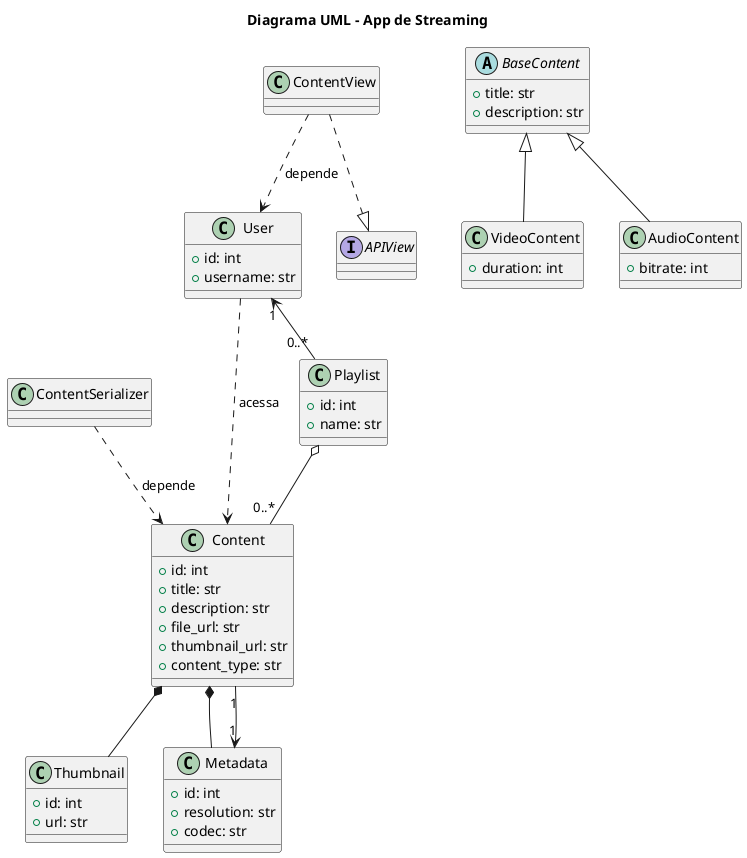

# 11 - Associações

Aplicando os conceitos da **Programação Orientada a Objetos (POO)** ao contexto do **App de Streaming de Áudio e Vídeo com Django REST**.

Abaixo, temos cada conceito com uma explicação e exemplos baseados nas classes já envolvidas, como `User`, `Content`, `Playlist`, etc.

---

## ✅ 1. **Associação**

> **Objetos se comunicam temporariamente.**

### 🔸 Exemplo:

Na view de listagem, a `ContentView` pode acessar dados do usuário apenas enquanto executa a requisição.

```python
class ContentView(APIView):
    def get(self, request):
        user = request.user  # Associação temporária com o objeto User
        contents = Content.objects.filter(owner=user)
        ...
```

---

## ✅ 2. **Agregação**

> **Relação "tem-um"** onde a parte pode existir sem o todo.

### 🔸 Exemplo:

Um `Playlist` **tem muitos `Content`**, mas os `Content` podem existir fora da `Playlist`.

```python
class Playlist(models.Model):
    user = models.ForeignKey(User, on_delete=models.CASCADE)
    name = models.CharField(max_length=100)
    contents = models.ManyToManyField(Content)
```

Aqui, `Content` existe independentemente da `Playlist`.

---

## ✅ 3. **Composição**

> **Relação "parte-de"**, onde a parte **não existe sem o todo**.

### 🔸 Exemplo:

Se criássemos um modelo `Thumbnail` separado, mas exclusivo para um único `Content`:

```python
class Content(models.Model):
    ...
    # Cada content tem um thumbnail que é excluído junto com ele
    thumbnail = models.OneToOneField("Thumbnail", on_delete=models.CASCADE)

class Thumbnail(models.Model):
    url = models.URLField()
```

O `Thumbnail` não existiria fora do `Content`.

---

## ✅ 4. **Herança**

> **"É-um"**: Uma subclasse herda de uma superclasse.

### 🔸 Exemplo:

Se tivermos tipos específicos de conteúdo:

```python
class BaseContent(models.Model):
    title = models.CharField(max_length=255)
    description = models.TextField()

class VideoContent(BaseContent):
    duration = models.IntegerField()

class AudioContent(BaseContent):
    bitrate = models.IntegerField()
```

`VideoContent` **é um** `BaseContent`.

---

## ✅ 5. **Dependência**

> Uma classe **usa** outra temporariamente.

### 🔸 Exemplo:

Um serializer que depende temporariamente de outro modelo:

```python
class PlaylistSerializer(serializers.ModelSerializer):
    class Meta:
        model = Playlist
        fields = ['name', 'contents']
```

Aqui, o serializer depende temporariamente da estrutura do `Playlist`.

---

## ✅ 6. **Realização**

> Implementação de uma **interface (abstração)**.

### 🔸 Exemplo:

Django não usa interfaces formais como Java/C#, mas usamos **abstrações como `APIView`**:

```python
class ContentListView(APIView):
    def get(self, request):
        ...
```

A `ContentListView` **realiza** (implementa) a interface da `APIView`.

---

## ✅ 7. **Associação Bidirecional**

> Duas classes se referenciam mutuamente.

### 🔸 Exemplo:

Um `User` tem `Playlists` e a `Playlist` tem um `User`.

```python
# Playlist aponta para User
class Playlist(models.Model):
    user = models.ForeignKey(User, on_delete=models.CASCADE)

# No código, você pode acessar bidirecionalmente:
playlist.user  # da playlist para user
user.playlist_set.all()  # do user para as playlists
```

---

## ✅ 8. **Cardinalidade (1:1)**

> Uma instância de um modelo se relaciona com exatamente uma instância de outro.

### 🔸 Exemplo:

Relacionamento entre `Content` e `Metadata`:

```python
class Content(models.Model):
    title = models.CharField(max_length=255)
    metadata = models.OneToOneField('Metadata', on_delete=models.CASCADE)

class Metadata(models.Model):
    resolution = models.CharField(max_length=50)
    codec = models.CharField(max_length=50)
```

Cada `Content` tem **um único `Metadata`**, e vice-versa.

---

### Diagrama de Classes

Abaixo temos o **diagrama UML em PlantUML** representando os conceitos de POO aplicados ao seu app de **streaming de áudio e vídeo** com base nos modelos discutidos:

---

### 📌 **PlantUML**



---

### ✅ Como usar

1. Copie esse código para um arquivo com extensão `.puml`, ou use um site como:

   * [PlantUML Live](https://www.plantuml.com/plantuml/)
   * [PlantText](https://www.planttext.com/)

2. Renderize o diagrama para ver visualmente os relacionamentos.

---


